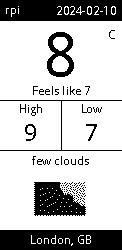
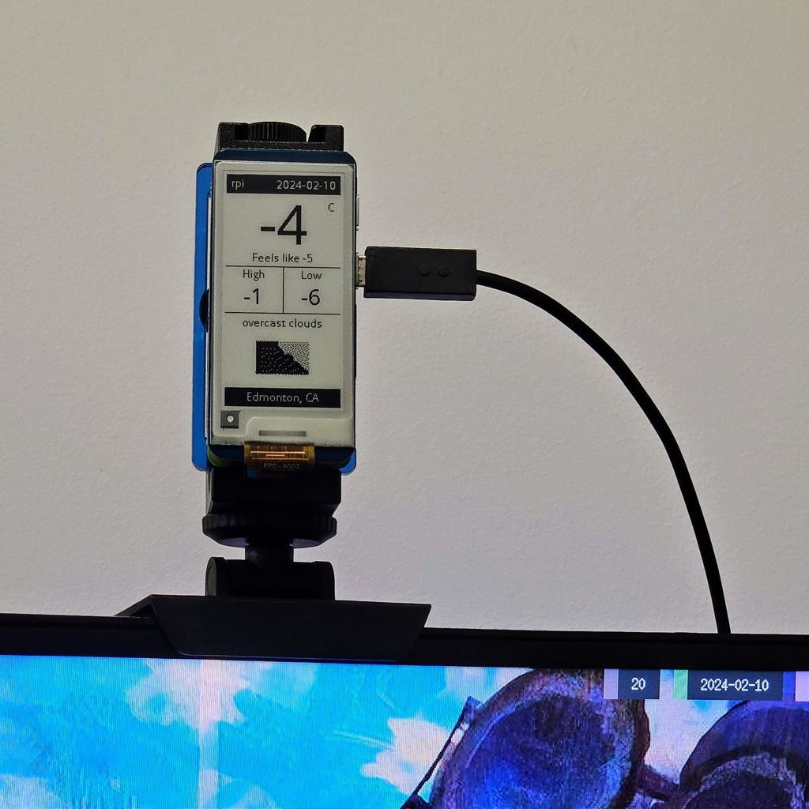

Simple weather display for a Raspberry Pi Zero W with a Waveshare 2.13" V4 e-Paper HAT display.

Based off of the python example from https://github.com/waveshare/e-Paper.git

### Usage

    usage: weather.py [-h] [-d] [-u UNITS] [-c CITYID] [-k KEY]

    A simple weather app for the Waveshare E-Paper display on a Raspberry PI

    options:
    -h, --help            show this help message and exit
    -d, --debug           Debug mode (outputs an image instead of writing to the display)
    -u UNITS, --units UNITS
                            Whether to use 'metric', 'imperial', or 'standard'
    -c CITYID, --cityid CITYID
                            City ID [ENV:OPENWEATHERMAP_CITY]
    -k KEY, --key KEY     OpenWeatherMap API Key [ENV:OPENWEATHERMAP_KEY]

### Running as a Service

Create a transient timer to update the display every 15 minutes, thus no need for a lengthly sleep() call in the code:

    systemd-run -u epaper-weather -r --uid=1000 \
        -E OPENWEATHERMAP_CITY=<city> -E OPENWEATHERMAP_KEY=<apikey> \
        --on-boot=60 --on-unit-active=900 python /path/to/weather.py

To manage the service, use systemd's built-ins:

    systemctl list-timers --all
    systemctl status epaper-weather.timer epaper-weather.service
    systemctl stop epaper-weather.timer

### Screenshot

    python3 weather.py -d --cityid 2643743

### In Action

